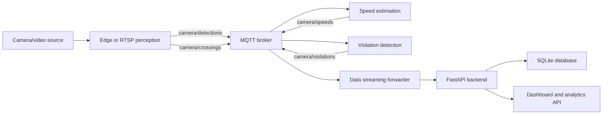

# Contributor Codebase Guide

This guide is the practical entry point for new contributors. It explains how the Road User Intelligence Platform is organized, how events move through the system, where to make common changes, and how to verify work locally.

## Project in One Paragraph

The platform processes camera streams into structured road-user events. Edge or RTSP perception agents run YOLO tracking and publish detection/crossing events to MQTT. Speed estimation consumes detections and publishes speed events. Violation detection consumes detections and speeds, applies rule-based safety checks, and publishes violations. A data streaming forwarder validates MQTT payloads against shared schemas and stores them through the FastAPI backend. The backend writes to SQLite by default, serves dashboard assets, and exposes analytics endpoints.

## Codebase Map

```text
.
|-- src/
|   |-- common/                Shared event schemas and camera config helpers
|   |-- edge_vision/           Local/video/edge camera detection, tracking, publishing
|   |-- rtsp_perception/       RTSP camera ingestion and multi-camera processing
|   |-- speed_estimation/      Object speed calculation from tracked detections
|   |-- violation_detection/   Rule engine for traffic and safety violations
|   |-- data_streaming/        MQTT-to-backend event forwarder
|   |-- backend_api/           FastAPI app, SQLAlchemy models, database setup
|   |-- dashboard/             Static dashboard app and design/templates
|   |-- data_engineering/      Batch ETL from stored events to analytics CSVs
|   |-- video_analysis/        Offline/sample video analysis helpers
|   `-- __init__.py
|-- config/                    Camera profiles, calibration, zones, counting lines
|-- docs/                      Architecture, deployment, requirements, contributor docs
|-- deploy/                    Production deployment docs, env examples, systemd units
|-- scripts/                   Operational helper scripts
|-- tests/                     Unit and integration tests
|-- run_pipeline.sh            Local end-to-end MVP runner
|-- requirements.txt           Python dependencies
`-- road_user_platform.db      Local SQLite database generated/used by the backend
```

## Runtime Data Flow



The shared schema is the contract between modules. When adding a new event type or field, update the schema first, then update publishers, consumers, backend storage, API serialization, and tests.

## Core Event Contract

The canonical event definitions live in `src/common/event_schemas.py`.

| MQTT topic | Schema | Main producer | Main consumers |
| --- | --- | --- | --- |
| `camera/detections` | `DetectionEvent` | `edge_vision`, `rtsp_perception` | speed estimation, violation detection, forwarder |
| `camera/speeds` | `SpeedEvent` | speed estimation | violation detection, forwarder |
| `camera/violations` | `ViolationEvent` | violation detection | forwarder, backend/dashboard |
| `camera/crossings` | `CrossingEvent` | edge line counter | forwarder, backend/dashboard |
| `camera/trajectories` | `TrajectoryEvent` | trajectory/simulation work | forwarder, backend/dashboard |

Important schema details:

- `class` is represented as `class_name` in Python using a Pydantic alias because `class` is a reserved keyword.
- `dump_event()` serializes events with JSON-compatible values and aliases, so MQTT/HTTP payloads use `class`.
- `parse_event_for_topic()` validates inbound MQTT payloads using the topic-to-schema registry.

## Main Modules

### `src/edge_vision`

This is the local/edge perception pipeline.

- `main.py` wires together capture, detection/tracking, line counting, live preview snapshots, and MQTT publishing.
- `camera_capture.py` wraps OpenCV video capture for camera indexes or video files.
- `detection.py` loads YOLO through `ultralytics` and runs ByteTrack tracking.
- `publisher.py` converts YOLO tracks into `DetectionEvent` payloads and publishes them to MQTT.
- `line_counter.py` detects configured counting-line crossings and emits `CrossingEvent` payloads.
- `live_preview.py` writes latest annotated JPEG snapshots used by backend live-camera endpoints.

Use this module when changing object classes, detection confidence, live preview behavior, or edge-side MQTT publishing.

### `src/rtsp_perception`

This module is the RTSP-oriented version of perception.

- `main.py` loads cameras, starts one processing thread per camera, runs shared detection, and publishes detections.
- `rtsp_ingestion.py` handles RTSP frame capture.
- `config_loader.py` loads camera definitions.
- `shared_modules.py` imports shared edge detection/publisher classes for reuse.

Use this module when integrating IP cameras or adjusting multi-camera stream handling.

### `src/speed_estimation`

This service subscribes to `camera/detections`, tracks object positions, and publishes `camera/speeds`.

- `main.py` owns MQTT subscription/publication and per-camera calculator setup.
- `calibration.py` converts pixel distance into meters using `pixels_per_meter`.
- `speed_calc.py` stores recent object positions and estimates km/h from bottom-center bbox movement.

Camera-specific speed settings come from `config/cameras.yaml`, including `pixels_per_meter`, history size, smoothing, max speed, and outlier handling.

### `src/violation_detection`

This service subscribes to detections and speeds, maintains recent object state, applies rules, and publishes violations.

- `main.py` owns MQTT wiring, CLI/env configuration, and per-camera rule engine setup.
- `violation_rules.py` implements rule evaluation.

Currently supported rule families include:

- speeding and severe speeding
- helmet violations for motorcycle classes
- too many riders on a motorcycle
- stopped vehicle violations
- stop-line zone violations
- pedestrian-crossing and zebra-crossing violations

Most thresholds and zones can be configured globally or per camera in `config/cameras.yaml`.

### `src/data_streaming`

`mqtt_forwarder.py` is the bridge from MQTT to the backend API.

It subscribes to all registered platform topics, validates payloads with `common.event_schemas`, maps topics to HTTP endpoints, and sends POST requests to the FastAPI backend. This keeps backend persistence centralized and prevents raw unvalidated MQTT payloads from being stored.

### `src/backend_api`

This is the persistence and analytics API.

- `main.py` defines the FastAPI app, dashboard static mount, event ingestion endpoints, live-camera endpoints, evidence image serving, and analytics endpoints.
- `models.py` defines SQLAlchemy tables for detections, speeds, violations, crossings, trajectories, and devices.
- `schemas.py` re-exports the shared Pydantic event schemas for backend request validation.
- `database.py` creates the SQLAlchemy engine, initializes tables, and provides request-scoped DB sessions.

SQLite is the default database through `DATABASE_URL=sqlite:///./road_user_platform.db`. The code is structured so `DATABASE_URL` can later point to PostgreSQL.

### `src/dashboard`

The dashboard app is mounted by the backend at `/dashboard` when `src/dashboard/app` exists. The app fetches backend endpoints such as camera status, recent events, violation logs, and analytics summaries. Static dashboard HTML templates and design notes live under `src/dashboard/templates` and `src/dashboard/docs`.

### `src/data_engineering`

The ETL agent reads the SQLite database, transforms detection/speed/violation data with pandas, and writes analytics CSVs under `data/analytics` by default.

- `extraction.py` reads persisted event tables.
- `transformation.py` builds analytics-friendly datasets.
- `exporter.py` writes CSV outputs.
- `main.py` orchestrates one-shot or daemon ETL runs.

## Configuration

The main runtime configuration file is `config/cameras.yaml`.

It has two layers:

- `defaults`: values inherited by every camera.
- `cameras`: per-camera overrides such as camera URL, location, speed calibration, thresholds, counting lines, and polygon zones.

Common configuration fields:

| Field | Used by | Purpose |
| --- | --- | --- |
| `pixels_per_meter` | speed estimation | Converts bbox movement in pixels to meters |
| `speed_limit_kmh` | violation detection | Base speed limit for speed violations |
| `speed_tolerance_kmh` | violation detection | Extra tolerance before triggering speeding |
| `speed_history_size` | speed estimation | Number of recent points used for smoothing |
| `speed_smoothing_alpha` | speed estimation | Blends new speed estimates with previous speed |
| `zones` | violation detection | Polygon areas for stop line, pedestrian crossing, zebra crossing |
| `counting_lines` | edge line counter | Two-point lines used to emit crossing events |

Camera config parsing and normalization lives in `src/common/camera_config.py`.

## Local Development

Create and activate a virtual environment:

```bash
python3 -m venv .venv
source .venv/bin/activate
pip install -r requirements.txt
export PYTHONPATH="$PWD/src"
```

Run tests:

```bash
python -m unittest discover -s tests
```

Start only the backend:

```bash
uvicorn backend_api.main:app --host 127.0.0.1 --port 8000
```

Start the central stack without an edge camera process:

```bash
./scripts/start_central_stack.sh
```

Run the sample-video pipeline:

```bash
./run_pipeline.sh
```

Validate a running backend/camera:

```bash
./scripts/check_live_pipeline.sh http://127.0.0.1:8000 sample_video_01
```

## Environment Variables

Most entrypoints also accept CLI flags. Common environment variables include:

| Variable | Default | Used by |
| --- | --- | --- |
| `MQTT_BROKER_HOST` | `localhost` | edge, speed, violation, forwarder |
| `MQTT_BROKER_PORT` | `1883` | edge, speed, violation, forwarder |
| `BACKEND_API_URL` | `http://localhost:8000` | data streaming forwarder |
| `DATABASE_URL` | `sqlite:///./road_user_platform.db` | backend API |
| `CAMERA_CONFIG_PATH` | `config/cameras.yaml` | edge, speed, violation |
| `LIVE_PREVIEW_DIR` | `artifacts/live_frames` | edge writer, backend reader |
| `VIOLATION_EVIDENCE_DIR` | `artifacts/violation_evidence` | backend violation evidence capture |
| `DEFAULT_PIXELS_PER_METER` | `25.0` | speed estimation fallback |
| `DEFAULT_SPEED_LIMIT_KMH` | `60.0` | violation detection fallback |

Deployment examples for environment files live under `deploy/env`.

## API Surface

The backend exposes:

| Method/path | Purpose |
| --- | --- |
| `GET /` | Health/status check |
| `GET /dashboard/` | Static dashboard app |
| `GET /cameras/config` | Merged camera defaults and profiles |
| `GET /live/cameras` | Health snapshot for configured cameras |
| `GET /live/cameras/{camera_id}` | Health snapshot for one camera |
| `GET /live/cameras/{camera_id}/snapshot` | Latest live preview JPEG |
| `POST /detections` | Store a `DetectionEvent` |
| `POST /speeds` | Store a `SpeedEvent` |
| `POST /violations` | Store a `ViolationEvent` and capture evidence image if available |
| `POST /crossings` | Store a `CrossingEvent` |
| `POST /trajectories` | Store a `TrajectoryEvent` |
| `GET /analytics/summary` | Aggregate event counts |
| `GET /analytics/by-camera` | Per-camera counts |
| `GET /analytics/violations` | Violation breakdown |
| `GET /analytics/crossings` | Crossing breakdown |
| `GET /events/recent` | Recent detections, speeds, violations, and crossings |

There are additional log/detail endpoints in `src/backend_api/main.py`; check that file before changing dashboard calls.

## Testing Strategy

Tests live in `tests/` and use the standard library `unittest` runner.

Useful test files:

- `test_event_schemas.py`: validates Pydantic event parsing/dumping and topic registration.
- `test_speed_estimation.py`: checks calibration and speed calculation behavior.
- `test_violation_detection.py`: checks rule engine behavior and violation publishing.
- `test_line_counter.py`: checks line crossing detection.
- `test_backend_api.py`: checks backend ingestion, analytics, dashboard static serving, camera snapshots, and evidence images.
- `test_pipeline_integration.py`: simulates detection-to-speed-to-violation-to-backend persistence without a real MQTT broker.
- `test_camera_config.py`: checks camera profile normalization.
- `test_data_engineering.py`: checks ETL extraction/transformation/export behavior.

Before opening a PR or handing off work, run:

```bash
export PYTHONPATH="$PWD/src"
python -m unittest discover -s tests
```

## Common Contributor Tasks

### Add a New Event Field

1. Add the field to the relevant Pydantic model in `src/common/event_schemas.py`.
2. Update any publisher that creates that event.
3. Update any consumer that reads the event.
4. If the field must be persisted, update `src/backend_api/models.py` and the matching POST endpoint in `src/backend_api/main.py`.
5. Add or update tests for schema validation, forwarding, persistence, and analytics if applicable.

### Add a New MQTT Topic

1. Add a new event schema in `src/common/event_schemas.py`.
2. Register it in `MQTT_TOPIC_TO_SCHEMA`.
3. Add publisher logic in the producing module.
4. Add subscription/handling logic in each consuming service.
5. Add a topic-to-endpoint mapping in `src/data_streaming/mqtt_forwarder.py` if it should be persisted.
6. Add a backend endpoint/model if it needs storage.
7. Add integration tests with a fake MQTT message.

### Add a New Violation Rule

1. Add state fields and rule logic in `src/violation_detection/violation_rules.py`.
2. Add CLI/env defaults and camera-profile overrides in `src/violation_detection/main.py` if the rule has thresholds.
3. Document any new config fields in `config/cameras.yaml`.
4. Add unit tests in `tests/test_violation_detection.py`.
5. Add integration coverage if the rule depends on multiple event types.

### Add a New Camera

1. Add a camera entry to `config/cameras.yaml`.
2. Set `pixels_per_meter` and speed thresholds for that camera.
3. Add `zones` for stop line or crossing rules if needed.
4. Add `counting_lines` if the dashboard should count directional flow.
5. Start the central stack, then start the edge or RTSP agent with the new `camera_id`.
6. Use `scripts/check_live_pipeline.sh` to verify backend events.

### Change Dashboard Data

1. Find the dashboard API call in `src/dashboard/app/index.html` or templates.
2. Update or add the backend endpoint in `src/backend_api/main.py`.
3. Add tests in `tests/test_backend_api.py`.
4. Verify the dashboard through `http://127.0.0.1:8000/dashboard/`.

## Generated and Local Runtime Files

The following files/directories are runtime artifacts and generally should not be edited as source:

- `road_user_platform.db`
- `*.log`
- `logs/`
- `artifacts/live_frames/`
- `artifacts/violation_evidence/`
- generated analytics CSVs under `data/analytics/`

If a test or script creates these locally, avoid committing them unless the project owner explicitly wants sample artifacts.

## Design Principles to Preserve

- Keep MQTT payloads schema-first and validated.
- Keep camera-specific tuning in `config/cameras.yaml`, not scattered through service code.
- Keep modules independently runnable so edge, RTSP, backend, speed, violation, and ETL work can be developed separately.
- Prefer extending existing tests with fake MQTT/API clients before requiring real cameras or brokers.
- Keep dashboard-facing backend responses stable unless the dashboard is updated in the same change.
